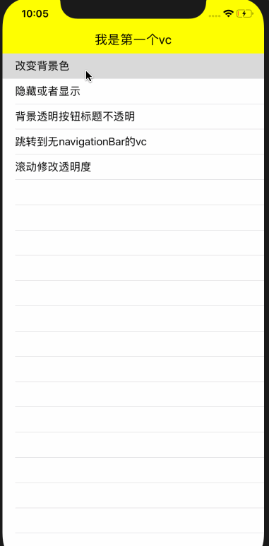

# NavigationBar



一行代码从UINavigationBar切换到NavigationBar

```
let nav = UINavigationController()
nav.nb.navigationBarEnable = true //就是这一行啦
```

切换过去有什么好处呢？

1. 每一个ViewController分配一个NavigationBar,再也不用在viewWillAppear和viewWillDisappear写那么多代码啦

2. 轻松的实现无bar和有bar页面的平滑过渡。

3. 滑动修改NavigationBar的透明度小菜一碟

4. 什么背景色啊，什么背景图片啊，都有

5. 调整左右按钮的边距，右边放两个按钮，Space.Size设置


坏处

老代码如果是设置UINavigationBar的效果不带过来，但是设置navigationItem的代码，不需修改，全部生效

没有largeTitle


## 使用

#### 全局样式
`NavigationBarAppearance`
```
    public var backgroundColor = UIColor.white
    public var titleAttribute : [NSAttributedString.Key : Any] = [NSAttributedString.Key.font:UIFont.systemFont(ofSize: 20),NSAttributedString.Key.foregroundColor:UIColor.black]
    //左右按钮 当baritem设置文字的时候生效
    public var viewAttribute : [NSAttributedString.Key : Any] = [NSAttributedString.Key.font:UIFont.systemFont(ofSize: 14),NSAttributedString.Key.foregroundColor:UIColor.black]
    //左边距
    public var leftViewSpace : CGFloat = 10
    //左视图之间的距离
    public var leftViewsSpace : CGFloat = 5
    public var rightViewSpace : CGFloat = 10
    public var rightViewsSpace : CGFloat = 5
    public var backgroundImage : UIImage?
    public var shadowImage : UIImage?
    public var shadowHeight : CGFloat = 1
```

一看就懂，不用解释。

当然，每个ViewController的NavigationBar你也一样设置自己的样式，默认是全局样式

#### NavigationBar设置

self 是ViewController
```
这三行代码是等效的
self.nb.navigationBar.title = ""
self.title = ""
self.navigationItem.title = ""

等效
self.nb.navigationBar.titleView = UIView()
self.navigationItem.titleView = UIView()

等效
self.nb.navigationBar.rightView = UIView()
self.navigationItem.rightBarButtonItem = UIView()

依次类推
```

本库把对navigationItem的设置全部转移到了NavigationBar上。
这意味着您之前的代码无需任何变动。

## 集成

pod 'NavigationBar', :git=> 'git@github.com:FengDeng/NavigationBar.git'
